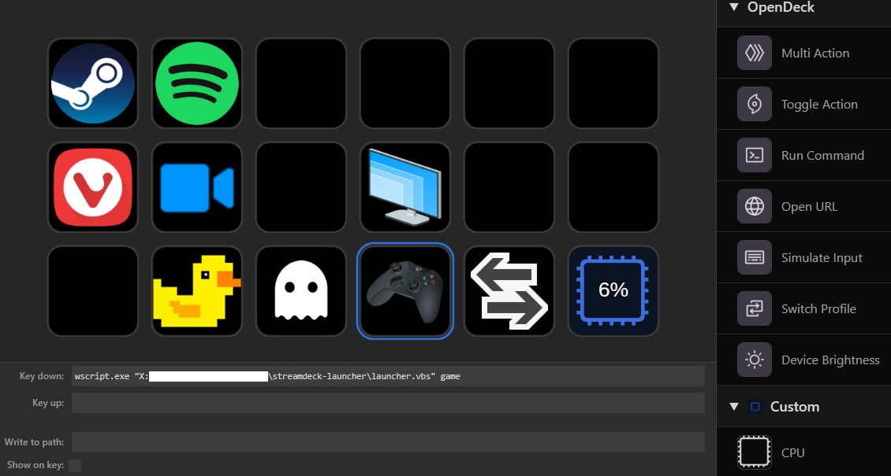

# Streamdeck Launcher

A small VBScript launcher for starting applications, Steam URIs, folders, and companion scripts from a Stream Deck button, shortcut, or command line.

It works especially well as a front end for `nvidia-display-profiles`: one Stream Deck button can launch the interactive game profile, while another can restore the normal desktop profile after playing.

## Setup

1. Create `launcher.ini` beside `launcher.vbs`, using `launcher.example.ini` as the layout reference.
2. Set executable paths and optional relative companion-script paths in `launcher.ini`.
3. Bind commands such as `wscript.exe launcher.vbs steam` or `wscript.exe launcher.vbs explorer "C:\Some\Folder"` to shortcuts or buttons.

`launcher.vbs` loads `launcher.ini` beside itself. Create that exact sibling filename from `launcher.example.ini`, then set the values for the machine where the launcher will run. A typical layout is:

```ini
[global]
script_host_exe=%SystemRoot%\System32\wscript.exe
explorer_exe=%SystemRoot%\explorer.exe

[profile:steam]
kind=exe
target=%ProgramFiles(x86)%\Steam\steam.exe
args=

[profile:game]
kind=script
target=..\nvidia-display-profiles\Run-GameProfile.vbs
args=

[profile:default]
kind=script
target=..\nvidia-display-profiles\Run-DefaultProfileHidden.vbs
args=
```

VBScript is used because `wscript.exe` can launch profiles, folders, URIs, and companion scripts without opening a command prompt; it is convenient for quiet Stream Deck buttons and background shortcuts. Executable paths can use Windows environment variables. Relative paths are resolved from the directory containing `launcher.vbs`, so the launcher remains portable when the repository is moved.

## Modular profiles

The launcher does not contain a fixed list of applications. Every `[profile:<name>]` section in `launcher.ini` becomes an available profile automatically. Add, remove, or duplicate a section to change the available buttons without editing `launcher.vbs`.

Each profile uses these keys:

- `kind=exe` launches an executable from `target`, optionally with raw `args`.
- `kind=uri` opens a URI such as a Steam protocol link from `target`.
- `kind=script` launches a VBScript companion from `target`, optionally with raw `args`.
- `kind=folder` opens the fixed folder in `target`.
- `kind=dynamic-folder` uses the remaining command-line arguments as the folder path; this is used by the `explorer` profile.

Executable, script, and folder targets may be absolute paths or relative paths. Relative paths are resolved from the directory containing `launcher.vbs`. For example, a repository-local documentation shortcut can be added with:

```ini
[profile:docs]
kind=folder
target=..\docs
```

The `[global]` section contains launcher-wide helpers. `script_host_exe` selects the Windows Script Host used for companion scripts, and `explorer_exe` selects the executable used for folder profiles. Keep the profile names aligned with the arguments configured in Stream Deck.

## Stream Deck examples

Create a **System → Open** or equivalent command action for `wscript.exe`, then pass the launcher script and profile name as arguments:

| Button purpose | Program | Arguments |
| --- | --- | --- |
| Launch a game display profile | `wscript.exe` | `launcher.vbs game` |
| Restore the desktop display profile | `wscript.exe` | `launcher.vbs default` |
| Open Steam | `wscript.exe` | `launcher.vbs steam` |
| Open a selected folder | `wscript.exe` | `launcher.vbs explorer "C:\Some\Folder"` |

The `game` and `default` entries use the relative paths in `launcher.ini` to call `Run-GameProfile.vbs` and `Run-DefaultProfileHidden.vbs` from `nvidia-display-profiles`. This keeps the two projects loosely coupled: the launcher owns the button-facing command, while the NVIDIA project owns display changes, monitor handling, elevation, and game selection. The relative paths continue to work after moving the repository as long as both project directories remain siblings.

## OpenDeck example

OpenDeck can bind the launcher through its **Run Command** action. The example below shows a button configured to run the `game` profile when pressed:



Use the launcher directory on your own machine in the command field. Quote the script path if the directory contains spaces:

```text
wscript.exe "C:\path\to\streamdeck-launcher\launcher.vbs" game
```

Replace `game` with any profile name from `launcher.ini`, such as `default`, `steam`, or a profile you added yourself. `wscript.exe` keeps the command quiet by running the VBScript without opening a command prompt, which makes it suitable for OpenDeck button actions.
